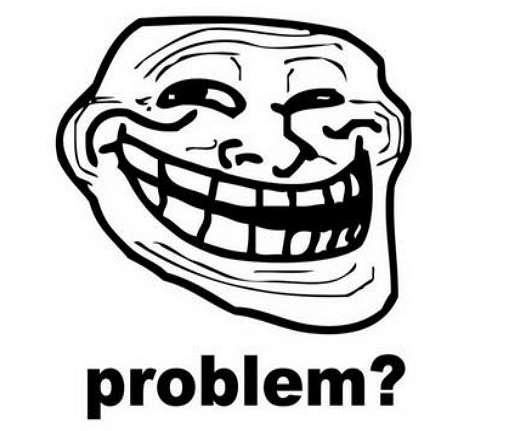
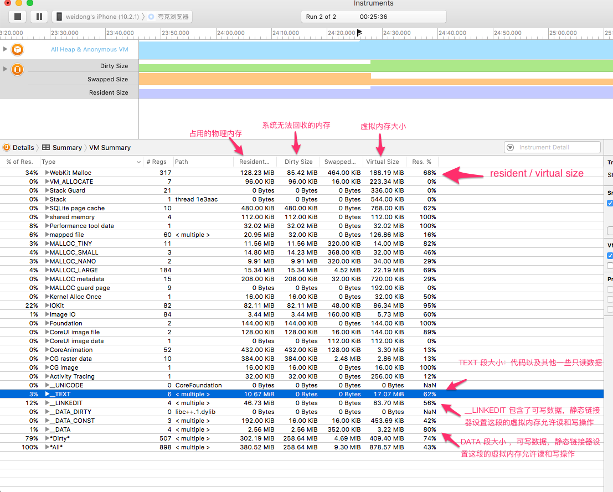
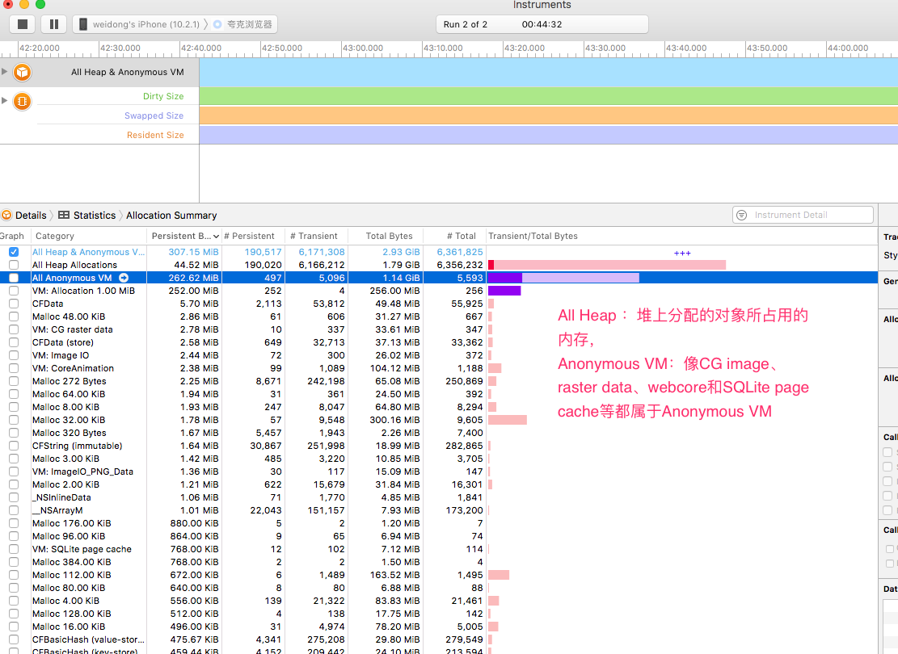

#爆内存 - Memory issue

##收集不到的崩溃日志？

>  做iOS的都知道，爆内存导致的闪退是无法收集的。如何定位这个问题，一般都是使用苹果提供的工具：Allocation 和 VM Tracker.使用的前提是，必须要连着电脑，无法通过这种手段定位线上的爆内存问题。

##在iOS系统上，谁负责kill 掉程序释放内存？

从这篇文章：[No pressure, Mon!
](http://www.newosxbook.com/articles/MemoryPressure.html)可以了解到，它叫：**Jetsam**. 在以下两种情况，程序会被kill掉。

> * HWM  - High Water Mark . Jetsam针对设备设定的单进程最大内存阀值，当应用占用内存超过最大内存阀值，就会被kill掉。
> 
> * 在系统内存紧张的时候，Jetsam会杀死一些优先级低的进程直到内存不再紧张，进程优先级是系统内核根据进程的状态以及进程占用的物理内存评估的，显然，进程的内存占用越大，优先级就会越低.

应用占用的内存越高，退到后台就越容易被kill!当用户切换到程序A，再切换程序B。程序B居然重新启动了，这时候，用户会一脸懵逼。

##内存有分类吗？

1) Clean Memory 
> * System framework
> * Binary executable of your app
> * Memory mapped files
> 

2) Dirty Memory
> * 所有非Clear Memory,系统无法回收 (Heap allocations,decompressed images,caches)

3) Virtual Memory
> * 虚拟内存 ，它由 Clean Memory + Dirty Memory

4) Resident Memory
> * 真正消耗的内存，它由 Dirty memory + Clean memory that loaded in physical memory

 VM Tracker 没有显示数据的话，通过点击右边的控制面板：Automatic Snapshotting 。重新启动就可以看到了

它们的关系：virtual memory == (clean memory + dirty memory) > resident memory > dirty memory

##爆内存的解决方案？

除了在应用内采取一系列的清理内存以及优化内存使用的操作，但是dirty的内存是没有办法处理的，只会累积。因此，确定程序哪里产生了dirty的内存至关重要！ 目前想到的方法是：Hook 系统底层堆内存及VM内存分配的相关方法，记录每一个内存块的分配信息，包括分配堆栈、累计分配次数、累计分配内存。在内存超过一定的阀值时候，将这些信息dump到本地磁盘。

TODO : 如何不影响正常使用的前提下，高效的hook系统底层方法！

##参考资料
[VM Tracker 详解](http://liam.flookes.com/wp/2012/05/03/finding-ios-memory/)

[内存分类](http://stackoverflow.com/questions/13437365/what-is-resident-and-dirty-memory-of-ios)

[Instrument VMTracker](https://developer.apple.com/library/content/documentation/DeveloperTools/Conceptual/InstrumentsUserGuide/Instrument-VMTracker.html)