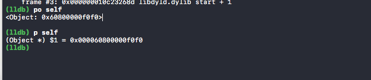

## lldb 调试实战

### 0x0 命令结构
```
<noun> <verb> [-options [option-value]] [argument [argument...]]

```
其中options和argument是可选的.

### 0x1 常用命令

1，设置断点：

```
(lldb) br set --file ViewController.m --line 20
Breakpoint 4: where = LLDB`-[ViewController viewDidLoad] + 54 at ViewController.m:20, address = 0x000000010a8f3696
```

2 ，查看当前thread 的backtrace

```thread backtrace``` 缩写为 ```bt```

```
* thread #1: tid = 0x82ccc, 0x000000010885d954 LLDB`-[Object init](self=0x000060800000f0f0, _cmd="init") + 20 at main.m:18, queue = 'com.apple.main-thread', stop reason = breakpoint 1.1
  * frame #0: 0x000000010885d954 LLDB`-[Object init](self=0x000060800000f0f0, _cmd="init") + 20 at main.m:18
    frame #1: 0x000000010885da27 LLDB`main(argc=1, argv=0x00007fff573a26a8) + 71 at main.m:27
    frame #2: 0x000000010c23268d libdyld.dylib`start + 1
    frame #3: 0x000000010c23268d libdyld.dylib`start + 1
```

3，查询变量
po的作用为打印对象 ，p即是print，也是expression --的缩写，与po不同，它不会打出对象的详细信息，只会打印出一个$符号，数字，再加上一段地址信息。由于po命令下，对象的description 有可能被随便乱改，没有输出地址消息。



$符号在LLDB中代表着变量的分配。每次使用p后，会自动为你分配一个变量，后面再次想使用这个变量时，就可以直接使用。我们可以直接使用这个地址做一些转换，获取对象的信息

4, watchpoint的作用是监控某一块内存的内容是否发生改变, 如果发生改变则断点断住.

```
 watchpoint set self->testVar     //为该变量地址设置watchpoint
 
 watchpoint set expression 0x00007fb27b4969e0 //为该内存地址设置
 
 watchpoint，内存地址可从前文提及的`p`命令获取
 
 watchpoint command add -o 'frame info' 1  //为watchpoint 1号加上子命令 `frame info`
 
 watchpoint list //列出所有watchpoint
 
 watchpoint delete // 删除所有watchpoint

```

### 0x2 Thread && Frame

用bt 打印出当前线程的堆栈信息，

```
(lldb) bt
* thread #1: tid = 0x82ccc, 0x000000010885d954 LLDB`-[Object init](self=0x000060800000f0f0, _cmd="init") + 20 at main.m:18, queue = 'com.apple.main-thread', stop reason = breakpoint 1.1
  * frame #0: 0x000000010885d954 LLDB`-[Object init](self=0x000060800000f0f0, _cmd="init") + 20 at main.m:18
    frame #1: 0x000000010885da27 LLDB`main(argc=1, argv=0x00007fff573a26a8) + 71 at main.m:27
    frame #2: 0x000000010c23268d libdyld.dylib`start + 1
    frame #3: 0x000000010c23268d libdyld.dylib`start + 1
```

这段backtrace信息中有两种不同类型的信息, 分别是thread 和 frame. 其中thread的格式如下:

```
(lldb) settings show thread-format
thread-format (format-string) = "thread #${thread.index}: tid = ${thread.id%tid}{, ${frame.pc}}{ ${module.file.basename}{`${function.name-with-args}${function.pc-offset}}}{ at ${line.file.basename}:${line.number}}{, name = '${thread.name}'}{, queue = '${thread.queue}'}{, activity = '${thread.info.activity.name}'}{, ${thread.info.trace_messages} messages}{, stop reason = ${thread.stop-reason}}{\nReturn value: ${thread.return-value}}{\nCompleted expression: ${thread.completed-expression}}\n"
```
其中关注下thread.index也就是当前的thread索引;frame.pc也就是frame停留位置的指令的地址(pc代表pc寄存器, 存放的是当前指令的地址); thread.queue当前queue的名字.


frame的格式如下:

```
(lldb) settings show frame-format
frame-format (format-string) = "frame #${frame.index}: ${frame.pc}{ ${module.file.basename}{`${function.name-with-args}${function.pc-offset}}}{ at ${line.file.basename}:${line.number}}{${function.is-optimized} [opt]}\n"
```

其中关注下frame.index也就是frame的索引;frame.pc也就是停留位置的指令的地址;还有就是方法名称和参数.

上面截出来的信息中, thread #1和frame #1前面有一个*, 代表当前选中的thread和frame.可以通过frame variable命令(缩写fr v)查看当前frame的变量:

### 0x3  常用的指令

```
bt // 打出当前thread的backtrace
bt all // 打出所有thread的backtrace
po [SomeClass returnAnObject] // 执行代码并打印出返回值的description
po $x9 = 0 // 直接写寄存器, 不要后面的`= 0`则是把寄存器`x9`的内容打出来
fr v // 打出frame的变量
fr s 1 // 选择frame
br s -n main // 在main方法处下断点
br s -f test.c -l 12 // 在test.c的第12行下断点
b -[NSString stringWithFormat:] // 在这个方法下断点
br s -S count // 给所有的selector是count的方法下断点
br s -n foo -c '(int)strcmp(y,"hello") == 0' // 条件断点
br s -a 0x10002ab0c // 在地址上下断点
br l // 列出所有断点
br del 1 // 删除1号断点, 可以通过 br l查断点号
w s v global_var // 对变量下watchpoint
w s e -- my_ptr // 对指针下watchpoint
w s e 0x10002ab0c //  对地址下watchpoint
w l // 打出watchpoint
w de // 删除watchpoint
ta v foo // 打印全局变量foo
reg re // 打出常用寄存器的内容
x -s4 -fx -c4 0xbffff3c0 // 打出内存内容. 完整命令是: memory read --size 4 --format x --count 4 0xbffff3c0
im list // 列出镜像
im lookup -a 0x00000001875b60fe // 从镜像中查地址对应的内容
im lookup -r -n <FUNC_REGEX> // 从镜像中用正则查出debug符号, 不带-r是不用正则
im lookup -r -s <FUNC_REGEX> // 从镜像中用正则查出非debug符号, 不带-r是不用正则
im lookup -t NSString // 从镜像中查找类型NSString
```


### 0x4 参考
[LLDB - GETTING STARTED](http://lldb.llvm.org/tutorial.html)

[LLDB - GDB TO LLDB COMMAND MAP](http://lldb.llvm.org/lldb-gdb.html)

[LLDB - STACK FRAME AND THREAD FORMAT](http://lldb.llvm.org/formats.html)

