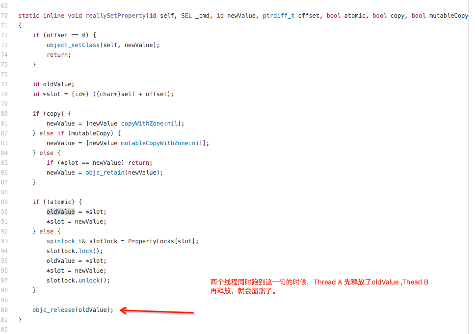

#多线程常见崩溃

##0x0 Block 回调的崩溃
在MRC环境下，使用Block 来设置下载成功的图片。当self释放后，weakSelf变成野指针,接着就悲剧了

```
 __block ViewController *weakSelf = self;
 [self.imageView imageWithUrl:@"" completedBlock:^(UIImage *image, NSError *error) {
        
        NSLog(@"%@",weakSelf.imageView.description);
 }];
 
```

##0x1 多线程下Setter 的崩溃
Getter & Setter 写多了，在单线程的情况下，是没有问题的。但是在多线程的情况下，可能会崩溃。因为***[_imageView release];*** 这段代码可能会被执行两次，oops!

UIKit 不是线程，所以在不是主线程的地方调用UIKit 的东西，有可能在开发阶段完全没问题，直接免测。但是一到线上，崩溃系统可能都是你的崩溃日志。Holy shit!

解决办法：[通过hook 住setNeedsLayout，setNeedsDisplay，setNeedsDisplayInRect来检查当前调用的线程是否是主线程](https://gist.github.com/steipete/5664345)。


```
- (void)setImageView:(UIImageView *)imageView
{
    if (![_imageView isEqual:imageView])
    {
        [_imageView release];
        _imageView = [imageView retain];
    }
}

```


##0x2 更多Setter 类型的崩溃
property 的属性，写的最多的就是nonatomic，一般情况下也是没有问题的！

```
@interface ViewController ()
@property (strong,nonatomic) NSMutableArray *array;
@end

```

跑一下下面这段代码,你会看到:
***malloc: error for object 0x7913d6d0: pointer being freed was not allocated***

```
for (int i = 0; i < 100; i++) {
        dispatch_async(dispatch_get_global_queue(DISPATCH_QUEUE_PRIORITY_DEFAULT, 0), ^{
            self.array = [[NSMutableArray alloc] init];
        });
    }    
```

原因就是：对象被重复relaese 了。查看一下[runtime 源码](https://github.com/opensource-apple/objc4/blob/master/runtime/objc-accessors.mm)



解决办法：属性声明为atomic.

一个更为常见的例子：

```
if(handler == nil)
{
	hander = [[Handler alloc] init];
}

return handler;
```

如果A,B两个线程同时访问到if语句, 此时handler == nil条件满足, 两个线程都走到下一句初始化实例.
此时A线程先完成初始化并赋值(这个实例我们叫它a), 然后继续往后走到其他逻辑.而这时候, B线程开始做初始化并赋值(这个实例我们叫它b), handler将指向B线程初始化出来的对象. 而A初始化出来的实例a因为引用计数减少1(减少到0)而被释放. 但在A线程中, 代码还会尝试访问a所在的地址, 这个地址里的内容因为被释放而变得无法预测, 从而导致野指针.

问题还有一个很关键的点, 在一个对象的某个方法的调用过程中, 这个对象的引用计数并不会增加, 到导致它如果被释放, 后续的执行过程中对这个对象的访问就可能会导致野指针[1].

```
Exception Type:  SIGSEGV
Exception Codes: SEGV_ACCERR at 0x12345678
Triggered by Thread:  1
```

简单加个锁就可以解决问题了：

```
 @synchronized(self){
 	if(handler == nil)
	{
		hander = [[Handler alloc] init];
	}
 }
return handler;
```


##0x3 多线程下对变量的存取
```
if (self.xxx) {
    [self.dict setObject:@"ah" forKey:self.xxx];
}
```

大家第一眼看到这样的代码，是不是会认为是正确的？因为在设置key的时候已经提前进行了self.xxx为非nil的判断，只有非nil得情况下才会执行后续的指令。但是，如上代码只有在单线程的前提下才是正确的。

假设我们将上述代码目前执行的线程为Thread A，当我们执行完if (self.xxx)的语句之后，此时CPU将执行权切换给了Thread B，而这个时候Thread B中调用了一句self.xxx = nil。 ***使用局部变量可以解决这个问题***

```
__strong id val = self.xxx;
if (val) {
    [self.dict setObject:@"ah" forKey:val];
}
```

这样，无论多少线程尝试对self.xxx进行修改，本质上的val都会保持现有的状态，符合非nil的判断。

##0x4 dispatch_group 的崩溃
```dispatch_group_enter``` 和 leave 必须是匹配的，不然就会crash . 在多资源下载的时候，往往需要使用多线程并发下载，全部下载完之后通知用户。开始下载，```dispatch_group_enter``` ,下载完成```dispatch_group_leave``` 。 非常简单的流程，但是当代码复杂到一定程度或者是使用了一些第三方库的时候，就很大可能出问题。


```
dispatch_group_t serviceGroup = dispatch_group_create();
dispatch_group_notify(serviceGroup, dispatch_get_main_queue(), ^{
    NSLog(@"Finish downloading :%@", downloadUrls);
});

// t 是一个包含一堆字符串的数组 
[downloadUrls enumerateObjectsUsingBlock:^(id  _Nonnull obj, NSUInteger idx, BOOL * _Nonnull stop) {
    dispatch_group_enter(serviceGroup);
    SDWebImageCompletionWithFinishedBlock completion =
    ^(UIImage *image, NSError *error, SDImageCacheType cacheType, BOOL finished, NSURL *imageURL) {
        dispatch_group_leave(serviceGroup);
        NSLog(@"idx:%zd",idx);
    };
    [[SDWebImageManager sharedManager] downloadImageWithURL:[NSURL URLWithString: downloadUrls[idx]]
                                                    options:SDWebImageLowPriority
                                                   progress:nil
                                                  completed:completion];
}];
```

使用多线程进行并发下载，直到所有图片都下载完成（可以失败）进行回调，其中图片下载使用的是SDWebImage.发生崩溃的场景是：***有10 张图片，分开两次下载（A & B）。其中在B组里面有一张图片和A组下载的图片重复了。假设A组下载对应GroupA ,B组GroupB***


下面截取SDWebImage源码：

```
dispatch_barrier_sync(self.barrierQueue, ^{
    SDWebImageDownloaderOperation *operation = self.URLOperations[url];
    if (!operation) {
        operation = createCallback();

        // !!!!!!!特别注意这行!!!!!!!!!
        self.URLOperations[url] = operation;

        __weak SDWebImageDownloaderOperation *woperation = operation;
        operation.completionBlock = ^{
          SDWebImageDownloaderOperation *soperation = woperation;
          if (!soperation) return;
          if (self.URLOperations[url] == soperation) {
              [self.URLOperations removeObjectForKey:url];
          };
        };
    }

// !!!!!!!特别注意这行!!!!!!!!!
id downloadOperationCancelToken = [operation addHandlersForProgress:progressBlock completed:completedBlock];
}
```
SDWebImage的下载器会根据URL做下载任务对应NSOperation映射，相同的URL会映射到同一个未执行的NSOperation。当A组图片下载完成后，相同的url 回调是 GroupB 而不是Group A。此时Group B的计数为1 。当B 组图片全部下载完后，结束计数为 5+1 。因为enter 的次数为5 ,leave 的次数为6 ,因此会崩溃！


##0x5

AR 红包崩溃 （coming soon）


